

<!--
*** Thanks for checking out the Best-README-Template. If you have a suggestion
*** that would make this better, please fork the repo and create a pull request
*** or simply open an issue with the tag "enhancement".
*** Don't forget to give the project a star!
*** Thanks again! Now go create something AMAZING! :D
-->

<!-- PROJECT SHIELDS -->
<!--
*** I'm using markdown "reference style" links for readability.
*** Reference links are enclosed in brackets [ ] instead of parentheses ( ).
*** See the bottom of this document for the declaration of the reference variables
*** for contributors-url, forks-url, etc. This is an optional, concise syntax you may use.
*** https://www.markdownguide.org/basic-syntax/#reference-style-links
-->

<!-- [![Contributors][contributors-shield]][contributors-url]
[![Forks][forks-shield]][forks-url]
[![Stargazers][stars-shield]][stars-url]
[![Issues][issues-shield]][issues-url]
[![MIT License][license-shield]][license-url] -->

[![LinkedIn][linkedin-shield]][linkedin-url]

<!-- PROJECT LOGO -->
 

  

<h3 align="center">Instaclone</h3>

  

    An Instagram clone created with React, Typescript, and Firebase.
     
    <a href="https://github.com/craigmclean39/instaclone"><strong>Explore the docs »</strong></a>
     
     
    <a href="http://instaclone-iota.vercel.app/">View Demo</a>
    ·
    <a href="https://github.com/craigmclean39/instaclone/issues">Report Bug</a>
    ·
    <a href="https://github.com/craigmclean39/instaclone/issues">Request Feature</a>
  

<!-- TABLE OF CONTENTS -->

  
<h2 style="display: inline-block">Table of Contents</h2>

  <ol>
    <li>
      <a href="#about-the-project">About The Project</a>
      <ul>
        <li><a href="#built-with">Built With</a></li>
        <li><a href="#libraries-used">Libraries Used</a></li>
      </ul>
    </li>
    <li>
      <a href="#getting-started">Getting Started</a>
    </li>
    <li><a href="#features">Features</a></li>
    <li><a href="#features">Screenshots</a></li>
    <li><a href="#contact">Contact</a></li>
    <li><a href="#acknowledgements">Acknowledgements</a></li>
  </ol>

<!-- ABOUT THE PROJECT -->

## About The Project

[![Product Name Screen Shot][product-screenshot]](https://craigmclean39.github.io/instaclone/)

Welcome to Instaclone! This is an instagram-like site created with React, Typescript, and Firebase. As part of the Fullstack Javascript path in The Odin Project I was tasked to replicate a popular site. I chose Instagram as it is site with lots of good features to attempt to implement. The backend is using Firebase. I utilize the Firestore, Authorization, and Cloud Storage features of Firebase.

(<a href="#top">back to top</a>)

### Built With

- [JavaScript](https://developer.mozilla.org/en-US/docs/Web/JavaScript)
- [CSS](https://developer.mozilla.org/en-US/docs/Web/CSS)
- [React.js](https://reactjs.org/)
- [Typescript](https://www.typescriptlang.org/)
- [Firebase](https://firebase.google.com/)
- [Create React App](https://reactjs.org/docs/create-a-new-react-app.html#create-react-app)

### Libraries Used

- [React Router v6](https://reactrouter.com/)
- [uniqid](https://www.npmjs.com/package/uniqid)

(<a href="#top">back to top</a>)

<!-- GETTING STARTED -->

## Getting Started

Take a look at the demo <a href="https://instaclone-iota.vercel.app/">here.</a>

## Features

- The ability to create an account with email/password or login to an existing account 
- A paginated feed with posts in reverse chronological order of the users you follow. Scrolling to the bottom of the feed will load the next 5 images. 
- An explore page that shows recent images of all users. Allows you to find new users to follow.
- A profile page that shows you your uploaded images, allows you to upload a profile picture, as well as show lists of users you follow and who follow you.
- The ability to like and comment on posts.
- The ability to follow and unfollow users.
- Each post has it's own unique page where you can view it's comments. If it's your post, you can delete it from this page.
- User can create a post in a 3 stage process. First they choose an image from their computer or phone, or drag a photo onto the component. Then the user can crop the photo into a square image. Finally they can choose to add a comment to their post before sharing.
- Desktop and mobile support.

## Screenshots

Feed 
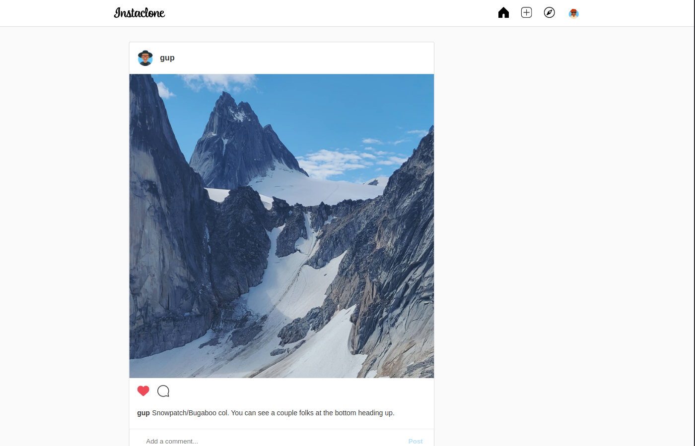 
Explore 
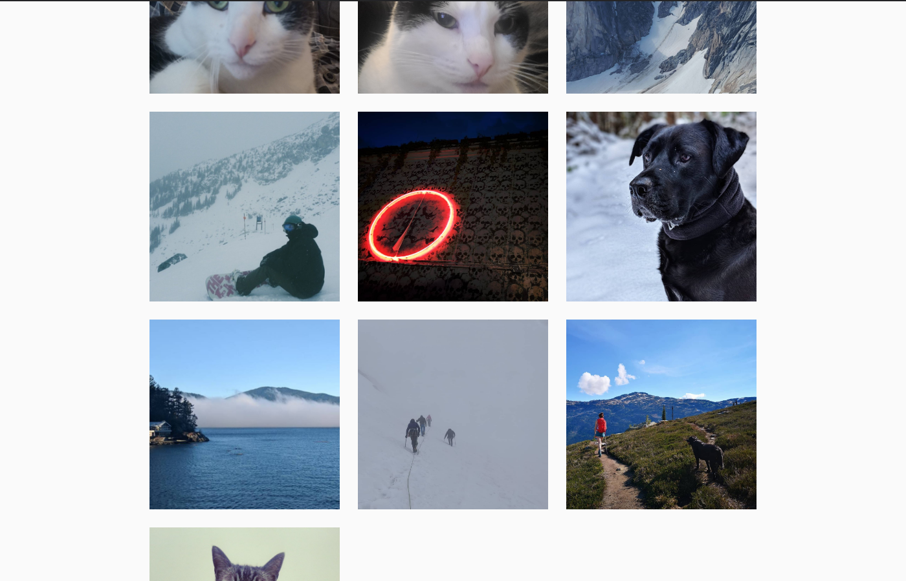 
Profile 
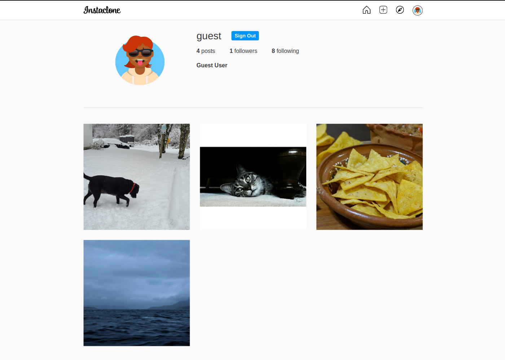 
Following 
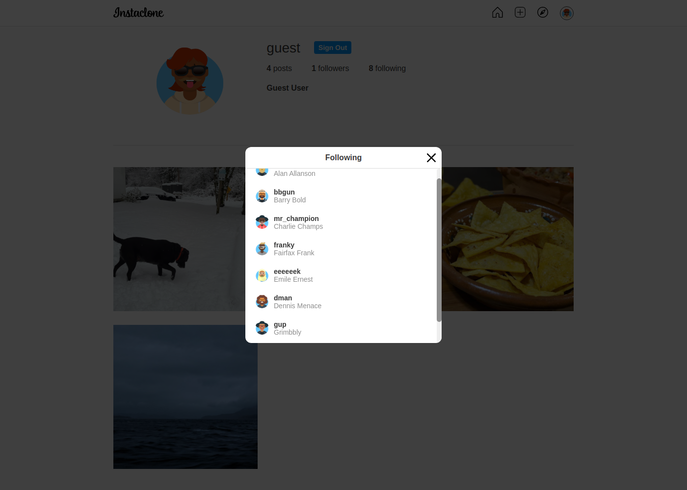 
New Post Flow 
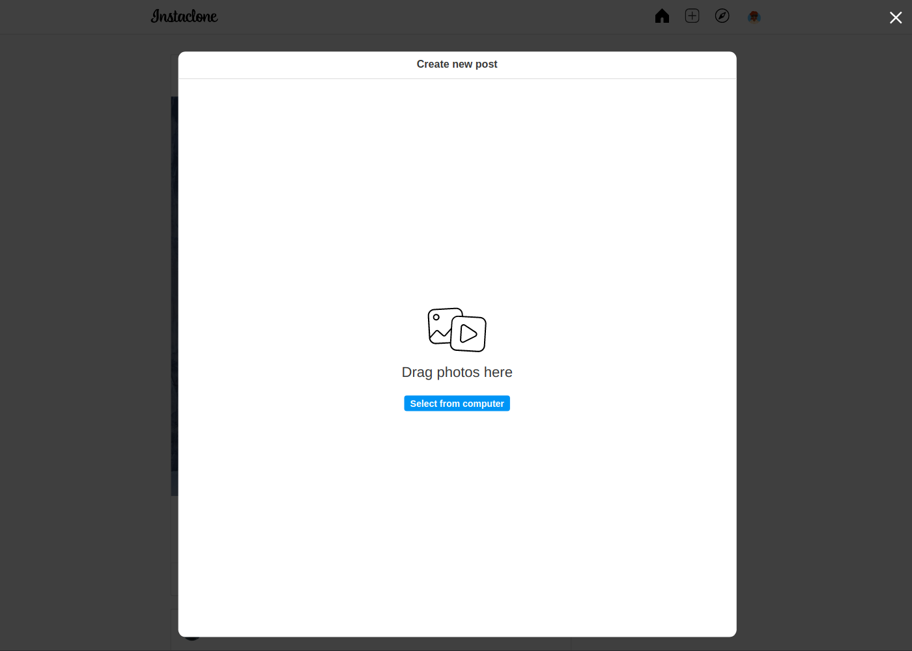 
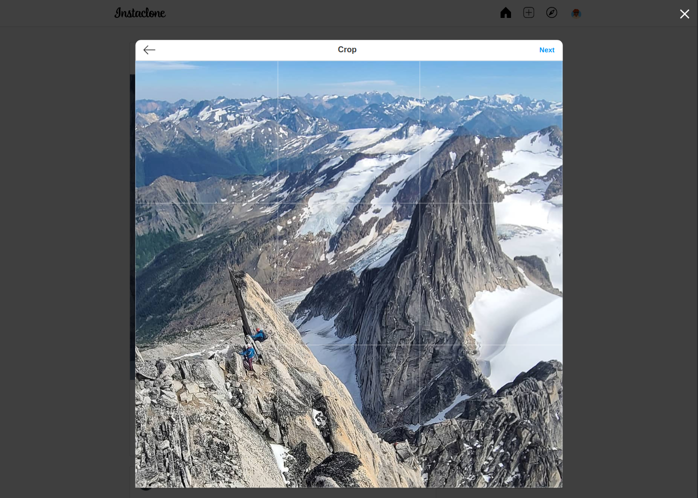 
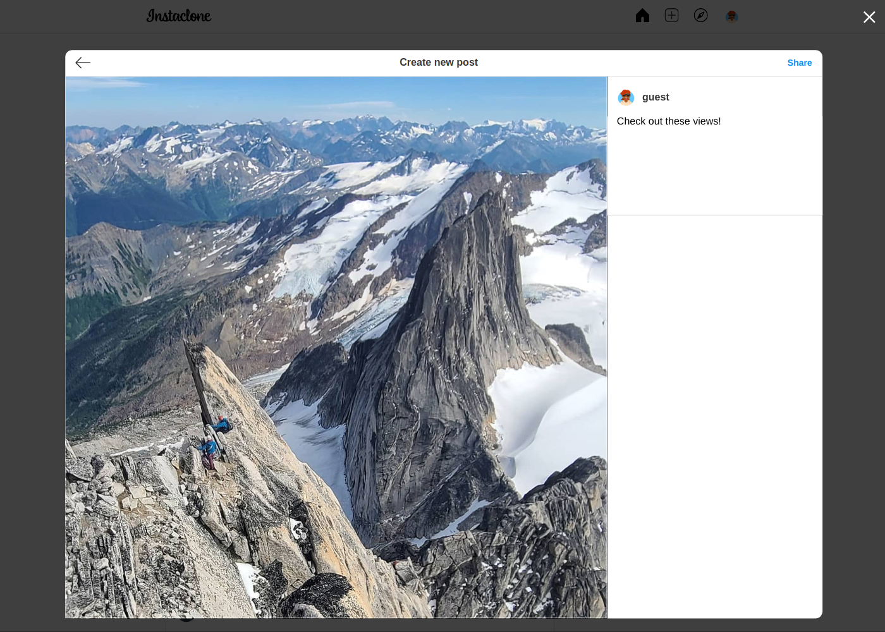 
Login and Signup 
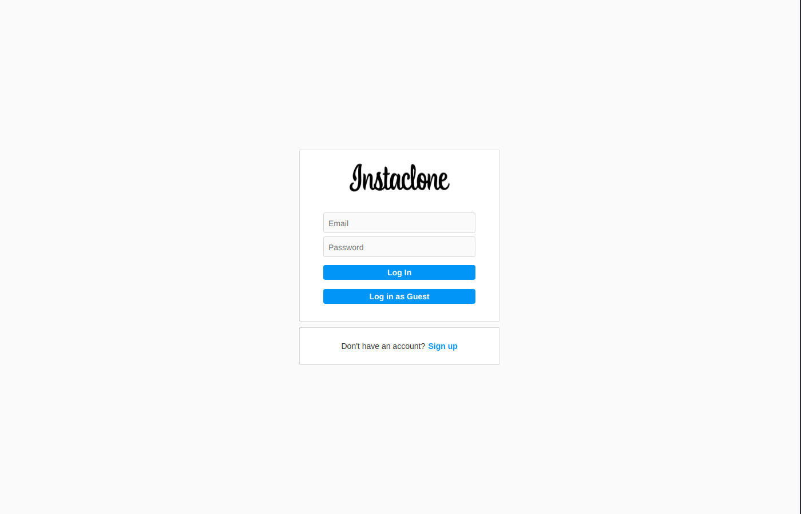 
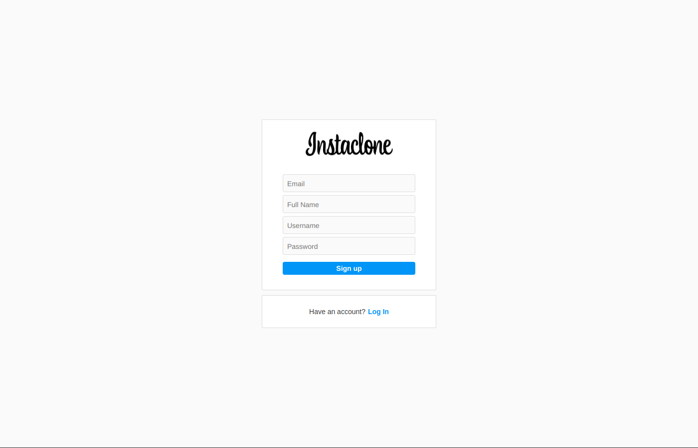 
Individual Post 
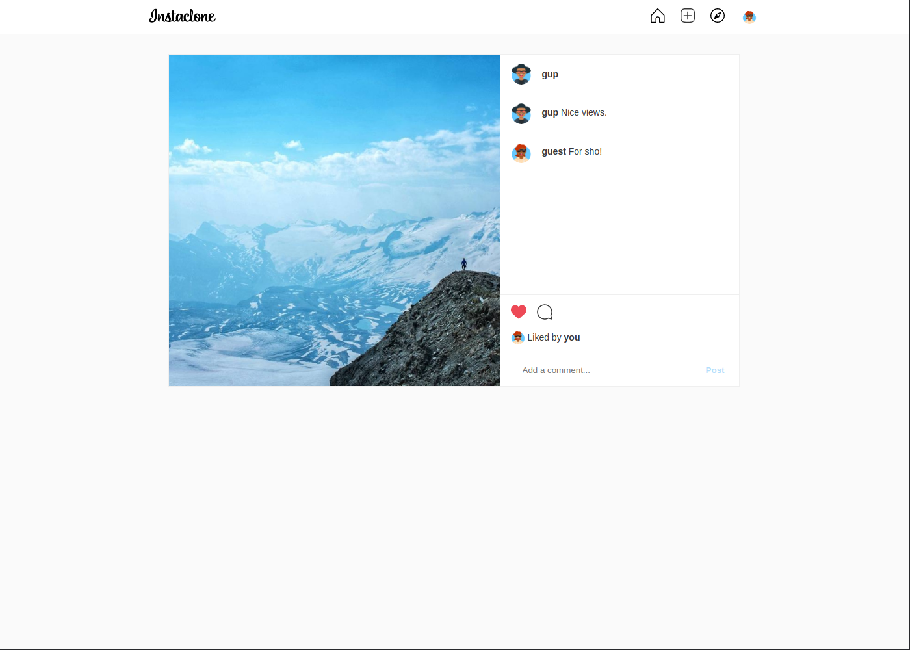 
Mobile Support 
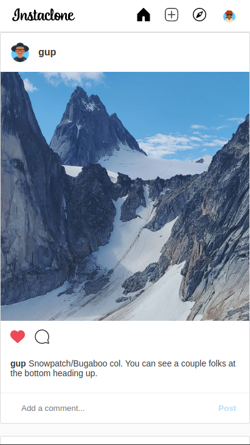
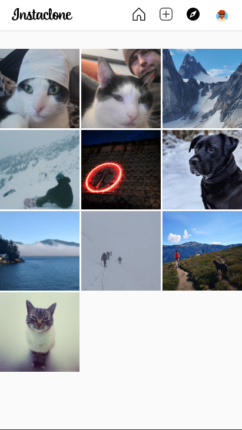
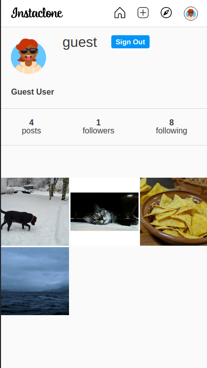
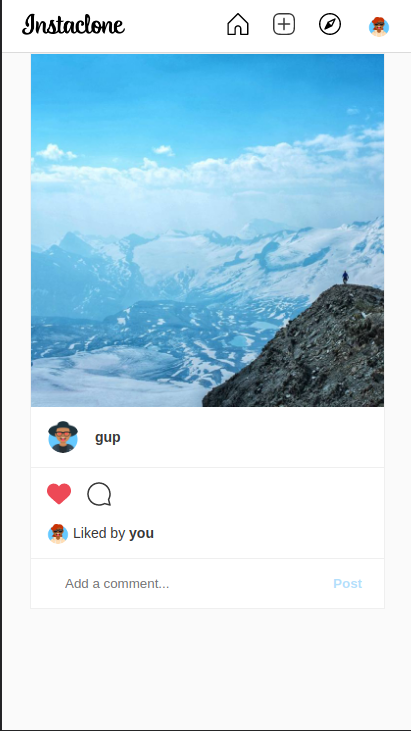
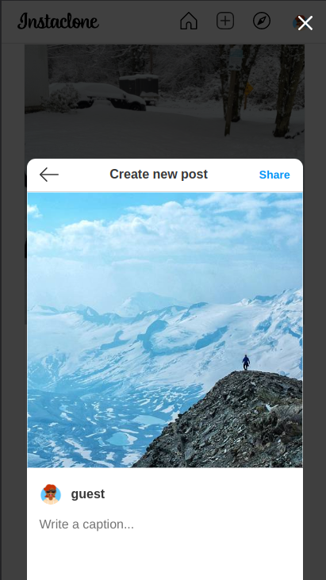

<!-- CONTACT -->

## Contact

Craig McLean - craig@craigmclean.dev 
https://www.linkedin.com/in/mcleancraig/

Project Link: [https://github.com/craigmclean39/instaclone](https://github.com/craigmclean39/instaclone)

(<a href="#top">back to top</a>)

<!-- ACKNOWLEDGMENTS -->

## Acknowledgments

- [The Odin Project](https://www.theodinproject.com/)
- [Instagram](https://www.instagram.com/)

(<a href="#top">back to top</a>)

<!-- MARKDOWN LINKS & IMAGES -->
<!-- https://www.markdownguide.org/basic-syntax/#reference-style-links -->

[linkedin-shield]: https://img.shields.io/badge/-LinkedIn-black.svg?style=for-the-badge&logo=linkedin&colorB=555
[linkedin-url]: https://www.linkedin.com/in/mcleancraig/
[product-screenshot]: ./readme_media/postpage.png
